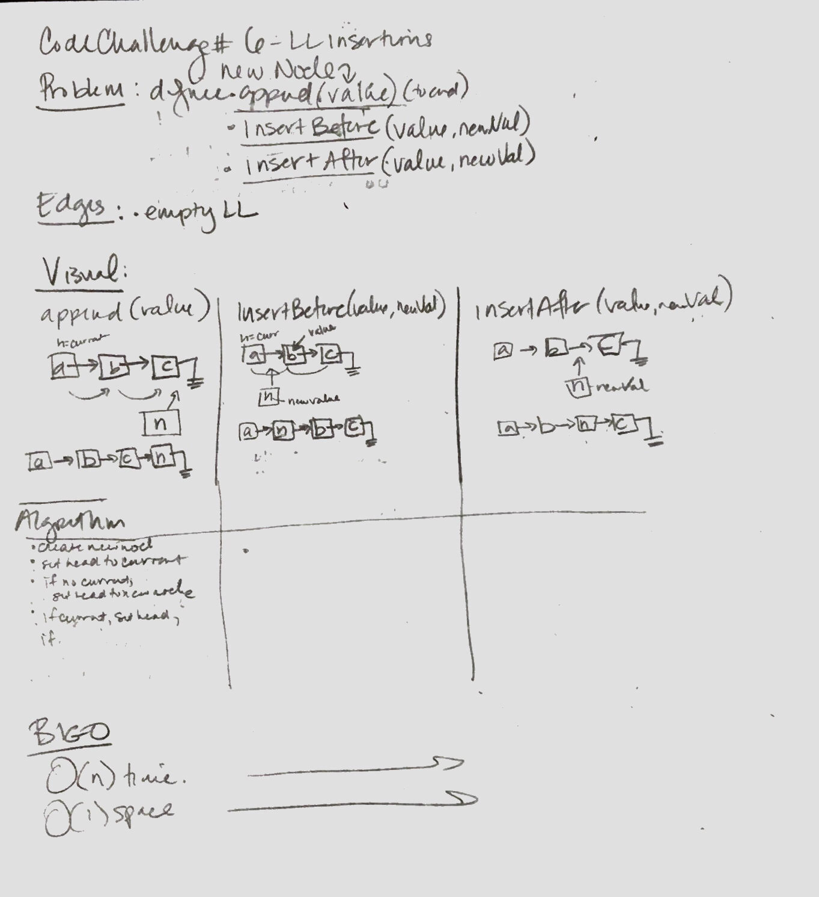
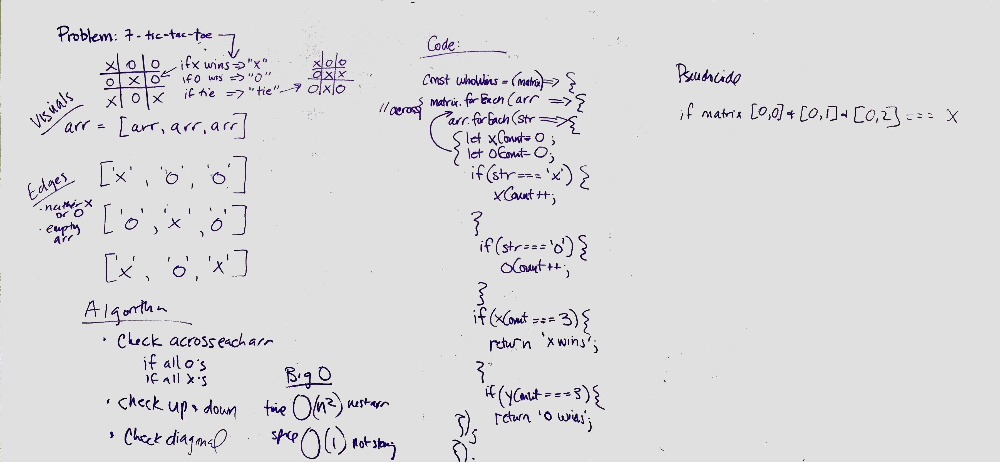
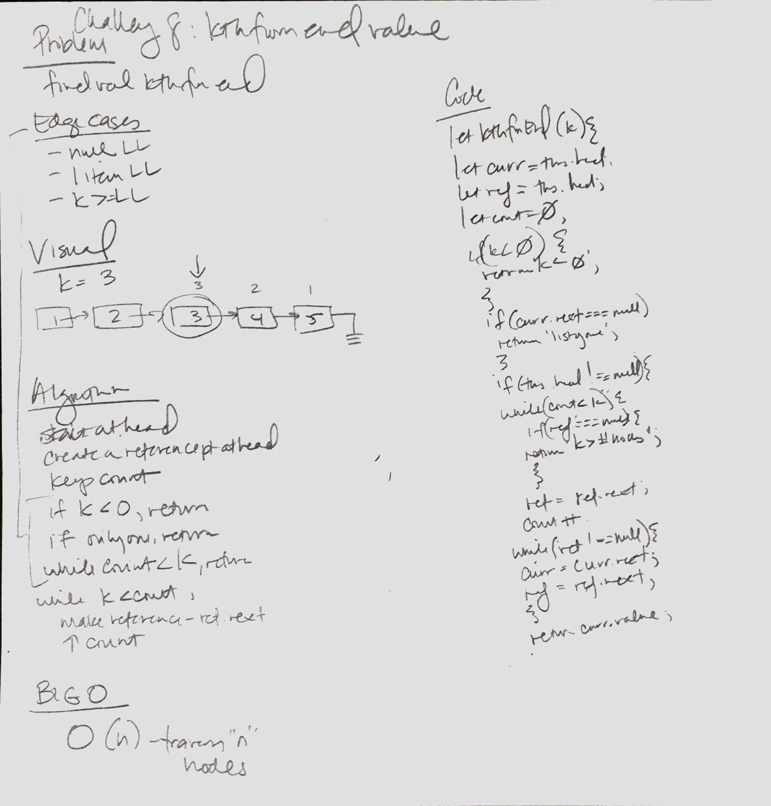
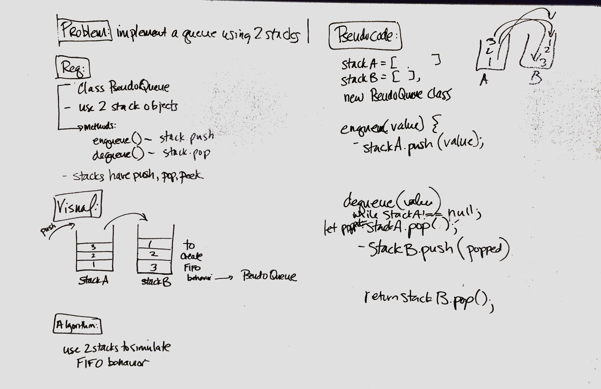
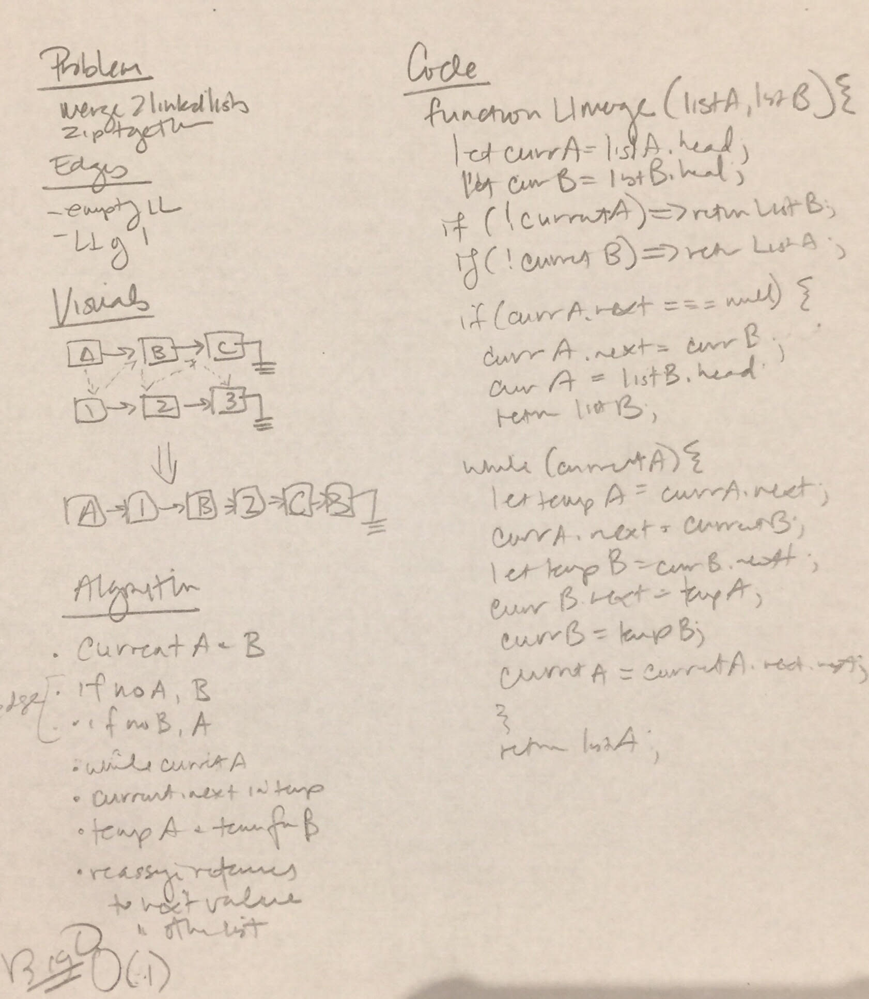
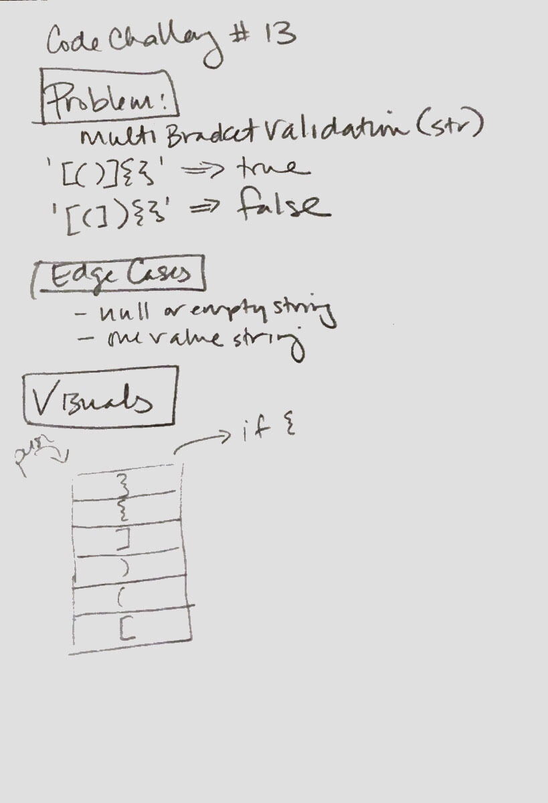
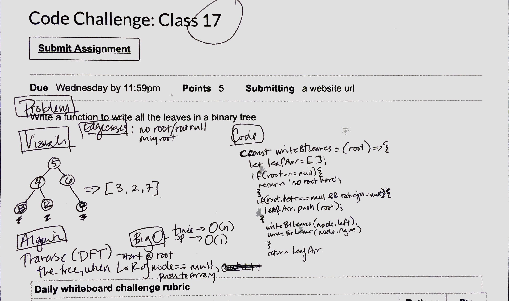

# data-structures-and-algorithms

## Table of Contents
1. challenge-01-reverseArray - 8.15.2019 - whiteboard: 
2. challenge-05-linked-lists - 8.24.2019
3. challenge-06-ll-insertions - 8.24.2019 - whiteboard: 
4. challenge-07-tic-tac-toe - 9.4.2019 - whiteboard: 
5. challenge-08-kth-value-from-end - 8.24.2019 - whiteboard: 
6. challenge-10-stack-and-queue - 8.24.2019
7. challenge-11-queue-with-stacks - 8.26.2019 - whiteboard: 
8. challenge-12-ll-merge - 8.27.2019 - whiteboard: 
9. challenge-13-multibracket-validation - 9.3.2019 - whiteboard: 
10. challenge-17-find-binary-tree-leaves - 9.4.2019 - whiteboard: 

***

# challenge-05-linked-lists

## The challenge was to:
* create Node class with this.value and this.next properties
* create LinkedList class with a this.head property
* empty linked list created upon instantiation of LinkedList class
* define insert method that adds a node to the head of the list with O(1) time performance
* define include method to check if a value exists returning true or false
* define a toString method to return a string representing all values in the linked list
* build passing testing for above functionality
* complete README

## Approach and Efficiency
* Big O of space/time: O(n)

## API
* insert()
* includes()
* toString()

***

# challenge-06-ll-insertions

## The challenge was to:
* define an append method to add a new node to the end of a list
* define an insertBefore method to add a new node immediately before a given value
* define an insertAfter method to add a new node with the new value immediately after the given value
* build passing testing for above functionality
* complete README

## Approach and Efficiency
* Big O of space/time: O(n)

## API
* append()
* insertBefore()
* insertAfter()

***

# challenge-07-tic-tac-toe - placeholder

***

# challenge-08-kth-value-from-end

## The challenge was to:
* write a method that takes a number (k) as a parameter and returns the node's value that is "k" from the end of the linked list

## Approach and Efficiency
* Approach I took: used the 'runners technique' and tested until passing
* Big O of space/time: O(n)

## API
* kthFromEnd()

***

# challenge-10-stack-and-queue

## The challenge was to:
* create a Node class with properties for value and pointer to next
* create a Stack class with a top property
  * creates an empty Stack when instantiated
  * object is aware of default empty value assigned to top when stack created
  * define push method - takes a value and adds a new Node with that value to the top of the stack with O(1) Time performance
  * define pop method - no argument, removes the node from the top of the stack, returns the node's value
  * define peek method - no argument, returns the value of the node located on top of the stack without removing it
* create a Queue class with a front property
  * creates an empty queue when instantiaed
  * object is aware of default empty values assigned to front when queue created
  * define enqueue method - takes any value, adds a new Node with that value back to the back of the queue with O(1) Time performance
  * define dequeue method - takes no argument, removes the node form the front of the queue, returns the nodes value
  * defines peek method - no argument, returns value of node located at front of queue, without removing it from the queue

## Approach and Efficiency
* Big O of space/time: O(1) because precise action, not iterating

## API
**Stacks**
* push()
* pop()
* peekTop()

**Queues**
* enqueue()
* dequeue()
* peekFront()

***

# challenge-11-queue-with-stacks

## The challenge was to:
Implement a Queue using two Stacks

## Approach and Efficiency
* Big O of space/time: O(1) for enqueue both space and time, O(n) for dequeue time and O(1) dequeue space

## API

***

# challenge-12-ll-merge

## The challenge was to:
Merge two link lists like a zipper

## Approach and Efficiency
* Big O of space/time: O(1) for enqueue both space and time, O(n) for dequeue time and O(1) dequeue space

## API

***

# challenge-13-multi-bracket-validation

## The challenge was to:
Validate whether string input includes brackets that are balanced
## Approach and Efficiency
* Big O of space/time: O(1) for enqueue both space and time, O(n) for dequeue time and O(1) dequeue space

## API

***

# challenge-17-find-binary-tree-leaves

## The challenge was to:
Return the values of all the leaves of the binary tree

## Approach and Efficiency
* Big O of space/time: O(n) for space and O(1) time
## API

